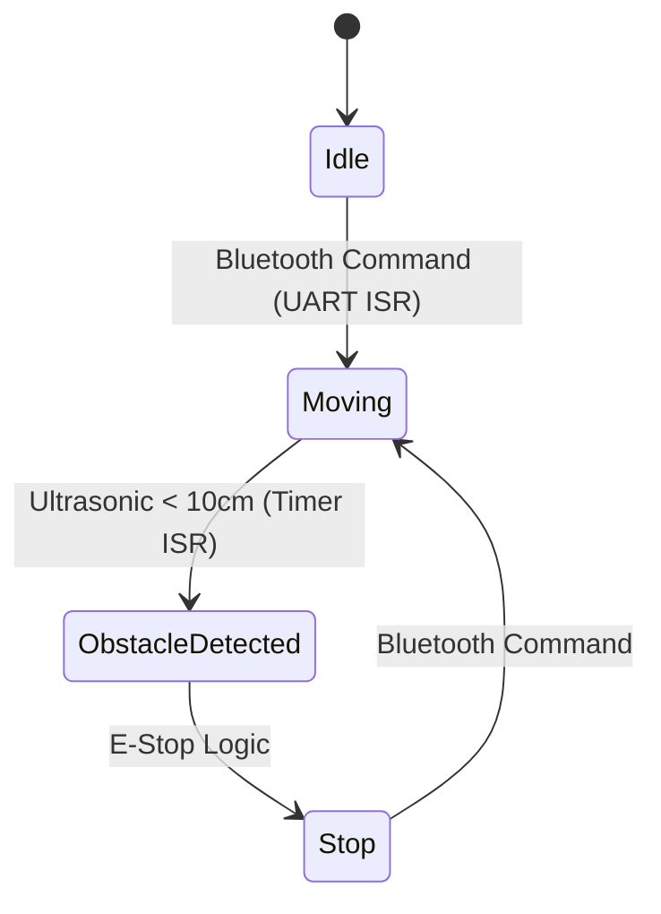

# WALL-E Desk Buddy Robot

**Role:** Embedded Software | **Context:** Microprocessors & Embedded Systems (MIE438)

## Project Overview
A "Bare Metal" mobile robot implementation using the STM32F446RE. The system processes commands via Bluetooth and manages concurrent sensor inputs using hardware interrupts.

## Tech Stack
* **MCU:** STM32 Nucleo-F446RE (ARM Cortex-M4)
* **IDE:** STM32CubeIDE
* **Protocols:** UART (Bluetooth), PWM (Motors), ADC (Sensors)
* **Concepts:** Hardware Timers, Interrupt Service Routines (ISRs)

## Firmware Logic

https://github.com/user-attachments/assets/bd52a55c-6bdc-4aa6-aacc-853ffeb42266
